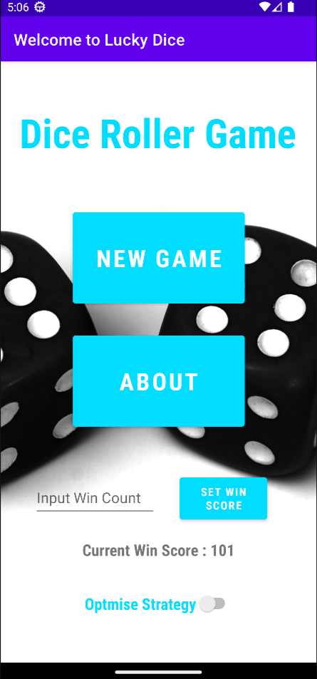
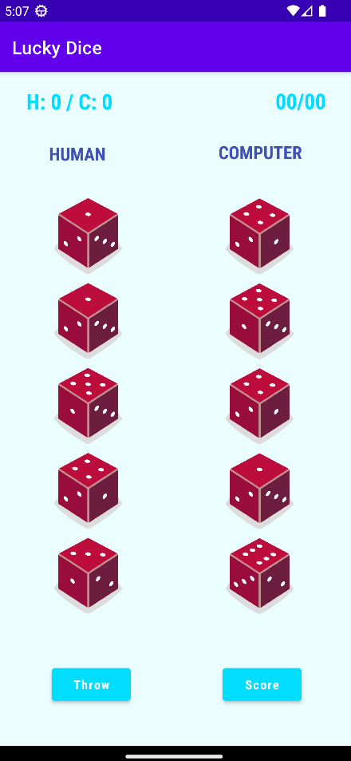
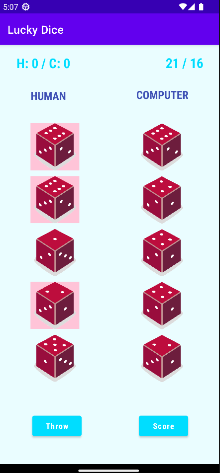
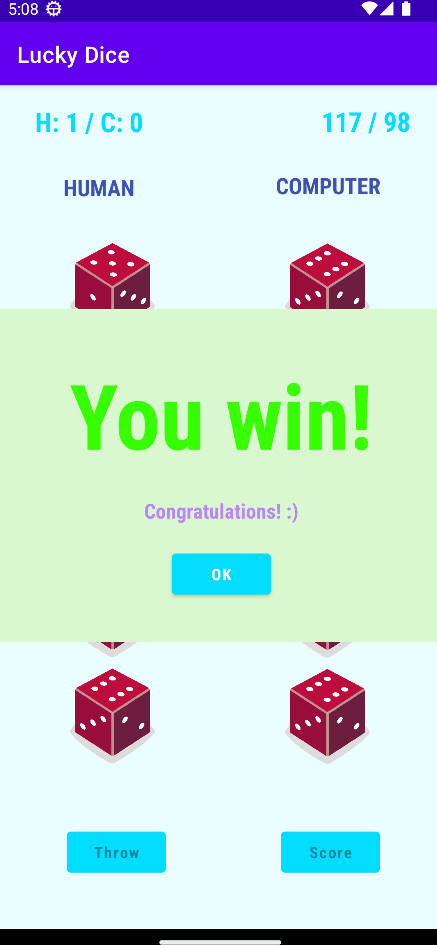

# LuckyDice
An Android Dice Roller game which allows the player to play against a computer. Developed using Kotlin.

## Features
- User friendly interface
- Two computer Strategies (Random/Intelligent)
- Ability ock dices from re rolling
- Change win threashold
- Resistant to configuration changes of the device (rotation, theme change, etc.)

## Project Description
A human player competes against the computer. Both players throw 5 dice at the same time. The score of each throw for each player is the sum of the numbers shown on the faces of the dice. The objective of the game is to reach a score of 101 or more (instead of 101 another target
can be set by the human before the game starts) by throwing 5 dice as many times as necessary.

## Screenshots
<table>
   <tr>
    <td> </td>
    <td></td>
   </tr> 
   <tr>
      <td></td>
      <td></td>
</table>

